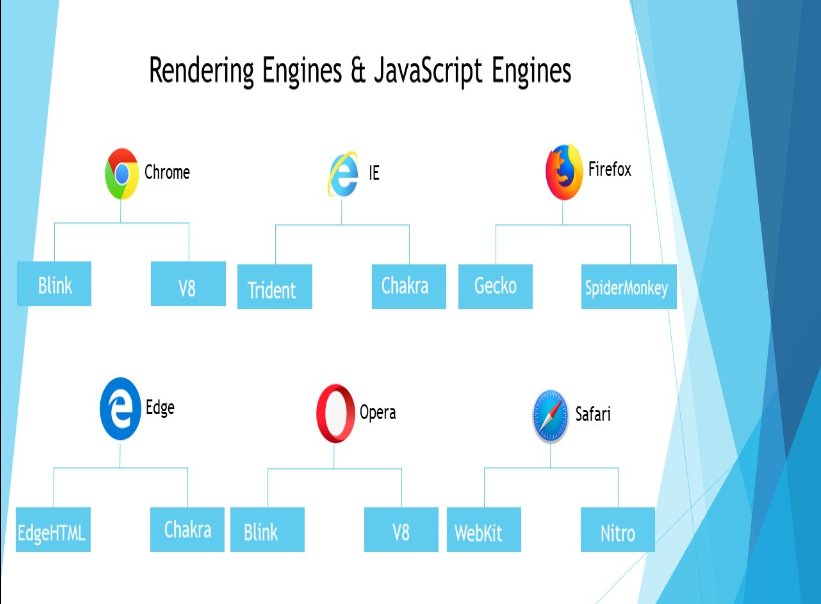
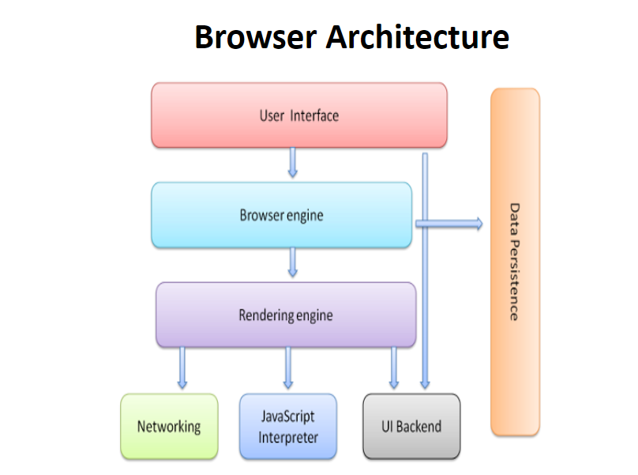

### Full Stack UI Notes 16th Feb 2024

##  Web Page
Summary
- Setup Environment
- Creating Project
		D:\Amazon-Shopping
		http://127.0.0.1:5500

						      Web Page
- It is a hyper text document that provides an UI from where user can interact with the resources in your application.

- The term "Hyper" refers to "Beyond".

- Hyper Text document comprises of content beyond what it shows to user.

- The web pages are classified into 2 types

		a) Static Page
		b) Dynamic Page

- Static Page comprises of same content to send as response every time. It have extentions
				.html
				.htm

- Dynamic Page comprises of content which is customized according to client request.
  It have extentions
		
				.jsp
				.php
				.asp
				.aspx
				etc..

FAQ: How to design a static or dynamic page?
Ans: 
	  Static & Dynamic page designs are created by using HTML, CSS, JavaScript..
	  Dynamic page additionally uses server side scripting.

### HTML
						        HTML
- Hyper Text Markup Language.
- Hyper text refers to the text that take user beyond what he can see on screen.
- Markup language is a presentation language.
- The term Markup refers to content marked for presentation.

Evolution of HTML:

-CERN Labs [Council for European Research & Nuclear ] introduced a language called GML for presentation in early 1960's.  [Generic Markup Language]

-Later It was improved and developed as "SGML" [Standard Generic Markup Language]

-In Early 1990's  "Tim Berners Lee" introduced "HTML", which is super set of GML & SGML.

-A community by name "IETF"  Internet Engineering Task Force, developed several versions of HTML. [ upto 3.1 version ].

-In early 2004  a community by name "WHATWG" [ Web Hyper Text Application Technology Work Group] started evolving and maintaning HTML till date.

- The early version is HTML 4.0 and the latest version is  HTML 5. [2014]

					       Browser Architecture
